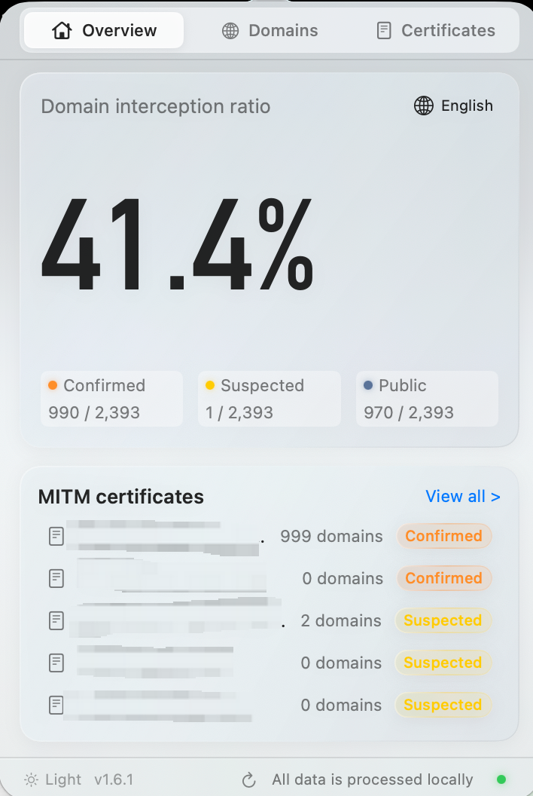

# SWGBar

A native macOS menu bar app for examining TLS inspection signals, certificate trust, and observed domains. The interface, documentation, and source comments are in English.

<p align="center">
  
</p>

## Install

Install the latest release from Terminal:

```bash
/bin/bash -c "$(curl -fsSL https://raw.githubusercontent.com/nonbutAworker/swgbar/main/install.sh)"
```

The script verifies the download's SHA-256 checksum and the app's code signature, then installs SWGBar in `~/Applications` for your user account. No administrator password is required. Quit SWGBar first if it is running. The app is not launched automatically.

You can also download the installer directly:

**[Download SWGBar for Apple Silicon](https://github.com/nonbutAworker/swgbar/releases/latest/download/SWGBar-macOS-arm64.pkg)**

- Requires macOS 14 or later and an Apple Silicon Mac (M1 or later).
- Quit an existing copy of SWGBar, open the downloaded package, and follow the macOS Installer prompts. The package installs `SWGBar.app` in `/Applications`.
- Launch SWGBar from Applications. Its panel opens from the menu bar; it has no Dock icon.
- This build uses ad-hoc app signing and is **not Developer ID signed or notarized**. If macOS blocks installation or launch, review the app-specific option in **System Settings > Privacy & Security > Open Anyway**. See [Apple's instructions](https://support.apple.com/en-us/102445). Managed Macs may restrict this option.

**Upgrading:** the current application resets its local database, rules, encryption key, and archived logs when it detects a newer version. Back up the data directories listed below before upgrading if you need to retain existing records. The installer itself contains no cleanup scripts.

Version checks compare numeric components and accept an optional `v` or `V` prefix. Equivalent versions and downgrades preserve existing data. A malformed or unreadable version marker is retained and does not trigger cleanup.

Release assets include `SHA256SUMS.txt` for checking the downloaded package:

```bash
shasum -a 256 -c SHA256SUMS.txt
```

## What the app shows

- **Overview:** TLS inspection metrics and relevant certificate clusters.
- **Domains:** discovered hostnames and ports, search and certificate filters, probe results, connection details, and certificate trust details.
- **Certificates:** certificate clusters, subjects and issuers, validity dates, fingerprints, and affected domains.
- **Monitoring controls:** pause and resume monitoring from the panel footer.

The app compares native macOS trust results with an independent public certificate baseline. Its classifications include confirmed inspection, suspected inspection, public trust, expected private trust, unknown, and excluded traffic. Classification depends on the collected evidence and configured rules; a repeated CA alone is not proof of inspection.

Active probes are separate connections made by SWGBar. Their certificate results do not establish which certificate a different application received. Unsupported traffic and missing evidence limit what the app can classify.

## Local data and network activity

SWGBar has no central analysis service. It stores observations locally, reads certificate trust information from macOS, imports hostnames from supported browser history databases when accessible, and uses packet metadata where capture permissions permit. Automatic and manual probes create outbound TLS connections to discovered targets.

Runtime files are stored in:

```text
~/Library/Application Support/SWGBar/
~/Library/Logs/SWGBar/
```

Selected database fields are encrypted using a local key. This does not encrypt all metadata or diagnostic logs: logs can contain hostnames, IP addresses, certificate subjects, and local paths. Review them before sharing. Runtime databases, keys, and logs are excluded from Git and release packages.

## Architecture

| Component | Responsibility |
| --- | --- |
| `SWGBarApp` | SwiftUI panel, AppKit menu bar integration, and presentation state |
| `SWGBarAgent` | Probe scheduling, classification, native trust evaluation, and snapshots |
| `SWGBarContracts` | Shared models, logging, and installation version tracking |
| `SWGBarStorage` | SQLite persistence and field encryption |
| `SWGBarFilter` | Flow metadata parsing and packet capture support |
| `coreworker` | Go TLS worker, IPv4 dialing, proxy CONNECT handling, and public PKIX validation |

The app bundles the Go worker and communicates with it over standard input and output. The release package does not install a privileged helper or a Network Extension system extension. Packet capture availability depends on local permissions.

## Build from source

Requirements:

- macOS 14 or later
- Xcode command-line tools with Swift 6 or later
- Go 1.22 or later
- Python 3 for the verification script

Build the native architecture of your Mac:

```bash
./scripts/build_app.sh
```

The app is written to `build/SWGBar.app`. Builds use path trimming and prefix maps to avoid embedding the checkout location in release binaries.

Create an installer for the current architecture:

```bash
./scripts/package_release.sh
```

The script builds the app and writes `build/SWGBar-macOS-<architecture>.pkg` and `build/SHA256SUMS.txt`. The published 1.6.1 package is built and tested on Apple Silicon. Intel binaries are not included in that release.

For the existing disk image and ZIP packaging workflow:

```bash
./scripts/package_dmg.sh
```

## Verify

Build the app before running the complete verification script:

```bash
./scripts/build_app.sh
./scripts/run_all_tests.sh
```

Verification covers SQLite schema creation, RPC schema parsing, Go tests, Swift tests, bundle signature integrity, and in-memory demo metrics. Ad-hoc signature verification checks bundle integrity; it does not establish Developer ID signing or notarization.

Run individual suites or inspect the version and demo snapshot:

```bash
(cd coreworker && go test ./...)
swift test
build/SWGBar.app/Contents/MacOS/SWGBarApp --version
build/SWGBar.app/Contents/MacOS/SWGBarApp --dump-demo
```

The version and demo commands do not open or reset the runtime database.
